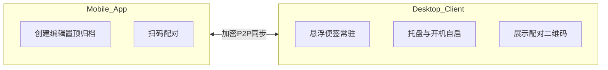
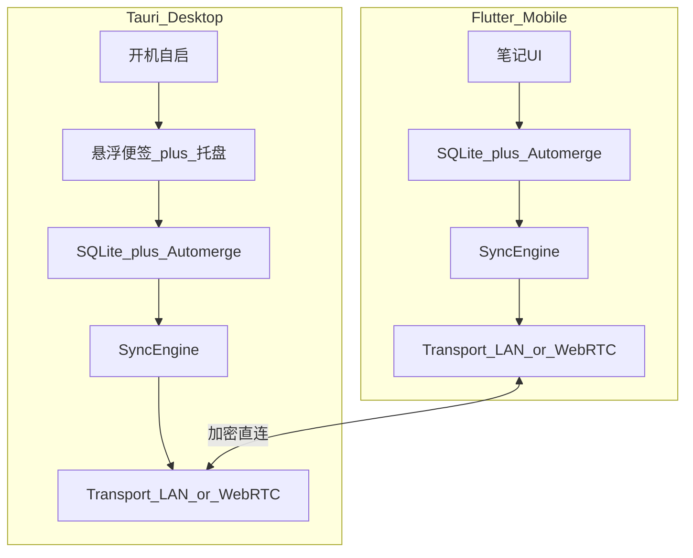

# MemoLink 设计文档：P2P 轻量备忘录

## 1. 产品定位

**一句话**：手机随手记，电脑桌面一眼见；数据只在你的设备之间流动。

| 维度 | 定义 |
|------|------|
| 名称（暂定） | MemoLink |
| 形态 | 手机 App + Windows 桌面客户端 |
| 核心价值 | 零账号、P2P 直连、桌面常驻可见 |
| 非目标（MVP） | 多用户协作、云端备份、富文本/附件、多平台桌面 |

**用户画像**：单人使用；在手机上快速记下待办/灵感；回到电脑前希望便签已挂在桌面上，无需打开浏览器或登录。

---

## 2. 端侧职责

- **手机**：主输入端。列表、编辑、置顶、完成/归档、触发同步状态。
- **电脑**：主展示端。开机自启、托盘常驻、桌面悬浮便签（一眼可见）；也支持本地轻量编辑（改字、勾完成），避免「只能看不能动」。

---

## 3. 推荐技术栈（已选定）

| 层 | 选型 | 理由 |
|----|------|------|
| 桌面 | Tauri 2 + Web 前端（React） | 包体小、内存低、适合常驻；Windows 托盘/开机自启成熟 |
| 手机 | Flutter | 单代码库覆盖 iOS/Android；后续可做桌面小部件 |
| 本地存储 | SQLite（两端） | 轻量、可查、易备份单文件 |
| 冲突合并 | Automerge（CRDT） | 离线两边改同一条也不互相覆盖 |
| 局域网发现 | mDNS（Bonjour） | 同 WiFi 自动发现，无需手输 IP |
| 跨网传输 | WebRTC DataChannel + 公网 STUN | 真 P2P；TURN 仅作可选自建兜底 |
| 配对信令 | 短时本地/嵌入式轻量信令（仅配对阶段） | 配对完成后不依赖中心服务器传便签内容 |
| 加密 | 设备密钥对 + 会话密钥（Noise 或 WebRTC DTLS） | 配对后信道加密，内容不出设备 |

---

## 4. 核心用户流程

### 4.1 首次配对

1. 电脑安装并启动 → 托盘出现 → 打开「配对」页，生成 **二维码**（含 `deviceId`、临时 `signalingTicket`、公钥指纹）。
2. 手机扫码 → 双方交换公钥与能力声明 → 建立加密会话。
3. 首次全量同步：手机 ↔ 电脑对齐全部备忘录。
4. 配对成功后，电脑桌面按「置顶 / 未完成」渲染悬浮便签。

配对关系持久化在本地（设备信任列表）；下次同网或可打通 NAT 时自动重连，无需重新扫码。

### 4.2 日常使用

1. 手机新建/修改便签 → 本地先写 SQLite + Automerge → 有连接则实时推送，无连接则入出站队列。
2. 电脑收到增量 → 合并 CRDT → 刷新对应悬浮窗位置与内容。
3. 电脑上勾选完成 / 微调文字 → 同样走本地 + 同步回手机。

### 4.3 开机展示

1. Windows 登录后由「开机启动项 / 任务计划」拉起 MemoLink（静默、无主窗口闪烁）。
2. 进程驻托盘；按上次布局恢复悬浮便签（位置、尺寸、置顶层级）。
3. 后台尝试重连已配对手机（局域网 mDNS 优先，失败再尝试 WebRTC）。

---

## 5. 系统架构

**模块划分（两端对称核心 + 端特有壳）**

- `domain`：Memo 模型、标签、置顶、完成状态
- `storage`：SQLite schema + Automerge doc 映射
- `sync`：连接管理、增量发送、冲突合并、重试队列
- `transport`：LAN（mDNS + QUIC/TCP）与 WAN（WebRTC）统一接口
- `desktop-shell`：托盘、开机自启、多悬浮窗、点击穿透开关
- `mobile-shell`：列表/编辑、扫码、前台服务保活（Android 按需）

---

## 6. 数据模型

### 6.1 Memo（业务视图）

| 字段 | 类型 | 说明 |
|------|------|------|
| `id` | UUID | 主键，端上生成 |
| `body` | string | 正文（MVP 纯文本，建议 ≤4KB） |
| `color` | enum | 便签色（桌面渲染用） |
| `pinned` | bool | 是否置顶展示 |
| `done` | bool | 是否完成 |
| `archived` | bool | 归档后默认不挂桌面 |
| `desktopX/Y` | float? | 电脑上次窗口位置（可只存电脑端，或同步以便换机） |
| `desktopW/H` | float? | 尺寸 |
| `updatedAt` | timestamp | 展示用；权威合并靠 CRDT |
| `createdAt` | timestamp | 创建时间 |

### 6.2 设备与配对

| 字段 | 说明 |
|------|------|
| `deviceId` | 稳定设备 ID |
| `publicKey` | 信任公钥 |
| `displayName` | 如「书房 PC」「Pixel」 |
| `pairedAt` | 配对时间 |
| `lastSeenAt` | 最近在线 |

### 6.3 同步单元

## 6.3 同步单元（实现备注）

设计目标为每条 Memo 一个 Automerge 文档。当前 MVP 实现采用 **LWW**（`updatedAt` → `revision` → `originDeviceId`）以便跨 Flutter / Rust 快速对齐；协议消息形状已预留，后续可替换为 Automerge 增量而不改配对流程。

删除用 `deleted=true` tombstone。

---

## 7. P2P 同步协议（要点）

详细消息格式与状态机见 [protocol.md](./protocol.md)。

### 7.1 连接策略（优先级）

1. **同局域网**：mDNS 广播 `_memolink._udp` → 直连 → 延迟最低（主路径）。
2. **跨网**：已配对设备用持久 `peerId` 走 WebRTC；信令仅用于 ICE 交换，**便签明文不经信令服务器**。
3. **都失败**：本地队列积压；UI 显示「待同步 N 条」；恢复连接后自动 drain。

### 7.2 消息类型（逻辑层）

- `hello`：版本、deviceId、协议能力
- `auth`：基于已配对密钥的会话握手
- `sync_offer` / `sync_answer`：Automerge heads / sync message
- `ping`：保活与 RTT

### 7.3 冲突策略

不采用「最后写入获胜」覆盖整条；正文与 `done`/`pinned` 均由 CRDT 合并。极端并发导致正文交错时，MVP 接受 Automerge 文本合并结果；后续可加「冲突标记 UI」。

---

## 8. 桌面悬浮便签 UX

**原则**：开机即见、不挡关键操作、信息密度低。

- 默认：半透明圆角便签、始终置顶（可设置）、无边框；标题栏极窄（拖拽 + 颜色点）。
- 展示集合：`pinned=true` 或（设置项）「所有未完成」；`archived/done` 默认隐藏。
- 交互：双击展开编辑；单击勾选完成；右键菜单（颜色、隐藏今日、取消置顶）。
- 布局：位置/尺寸持久化；支持「一键整齐排列」。
- 干扰控制：全局快捷键显示/隐藏全部便签；可选「鼠标穿透」模式。
- 开机：安装时注册当前用户 Startup；首次启动引导配对，之后静默恢复窗口。

---

## 9. 手机 UX（MVP）

- 首页：未完成列表 + 置顶区；FAB 新建。
- 编辑页：大输入框、颜色、置顶开关、完成。
- 底部/设置：已配对设备、同步状态、重新配对、导出本地备份（SQLite 文件）。
- 扫码页：相机扫电脑二维码。

---

## 10. 安全与隐私

- 无强制账号；数据默认仅存本机。
- 配对即建立信任根；未配对设备不可加入同步。
- 传输层加密；磁盘可选「应用锁」（系统生物识别，二期）。
- 信令服务器（若用）只转发 SDP/ICE，不落库存内容；可文档化「完全离线：仅局域网」模式供敏感用户关闭 WAN。

---

## 11. MVP 范围与分期

### MVP（可演示闭环）

- Windows 桌面：托盘 + 开机自启 + 多悬浮便签
- Android 先行（扫码与后台网络更易控）
- 同 WiFi mDNS 直连 + 全量/增量同步
- 纯文本 Memo：增删改、置顶、完成
- 二维码配对、设备信任列表

### v1.1

- WebRTC 跨网同步 + 公网 STUN
- 桌面本地编辑完善、全局快捷键、鼠标穿透
- iOS 补齐

### v1.2

- 可选自建 TURN、本地备份/导出、简单标签、到期提醒

---

## 12. 关键风险与对策

| 风险 | 对策 |
|------|------|
| 手机系统杀后台导致不同步 | 以「打开 App / 回前台」同步为主；Android 可选前台服务；不承诺 24h 实时推送 |
| 对称 NAT 导致 WebRTC 失败 | MVP 强调局域网；WAN 失败时明确提示「连同一 WiFi 或稍后再试」；后期可选 TURN |
| 悬浮窗被杀毒/权限拦截 | 安装引导说明；Tauri 窗口类型选用工具窗；提供「找不到便签」排查页 |
| CRDT 包体变大 | 单条文档 + tombstone GC；限制正文长度 |

---

## 13. 成功标准（MVP）

1. 电脑开机登录后 10 秒内托盘可见，上次便签布局恢复。
2. 同 WiFi 下手机新建一条，电脑便签 **2 秒内**出现。
3. 断网两边各改一条不同便签，恢复连接后两边一致且无互相覆盖丢失。
4. 安装包桌面侧目标：安装包 < 15MB，空闲常驻内存体感轻量（目标 < 80MB）。

---

## 14. 相关文档

- [protocol.md](./protocol.md) — 配对、连接与同步协议（实现用）
