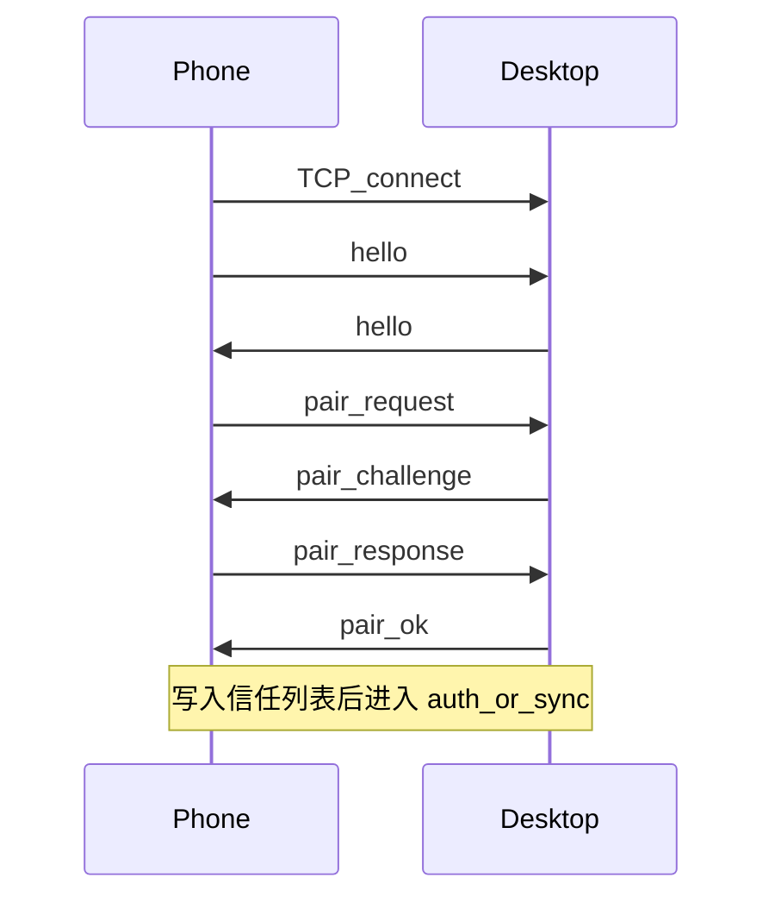
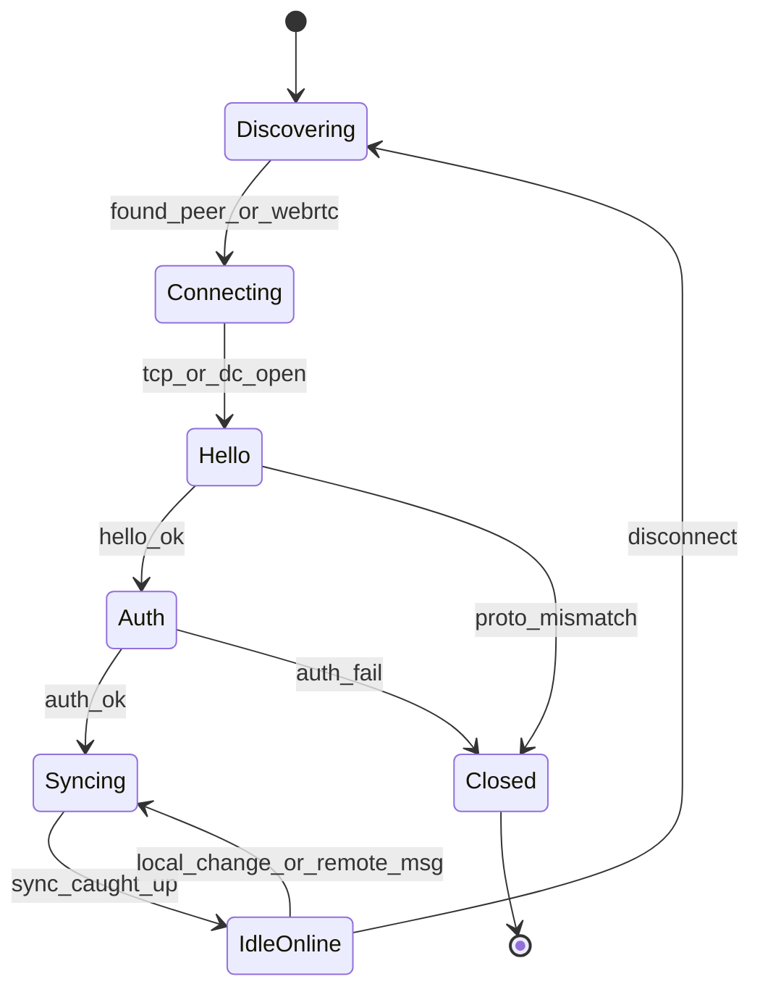

# MemoLink 协议规范

本文定义配对、传输与同步的消息格式与状态机，供桌面（Tauri）与手机（Flutter）实现对齐。产品背景见 [design.md](./design.md)。

**协议版本**：`1`（字段 `protoVersion`）

---

## 1. 约定

| 项 | 约定 |
|----|------|
| 字节序 | 网络字节序（大端）用于长度前缀 |
| 帧封装 | `u32 length` + `UTF-8 JSON` 正文（LAN TCP）；WebRTC DataChannel 直接发 JSON 文本帧 |
| 时间 | Unix 毫秒（UTC） |
| ID | UUID v4 字符串 |
| 公钥编码 | Ed25519，Base64URL（无填充） |
| 能力协商 | `hello.caps` 字符串数组；未知能力忽略，不中断连接 |

### 1.1 能力标识（caps）

| 值 | 含义 |
|----|------|
| `sync.v1` | Automerge 增量同步 |
| `lan.mdns` | 支持 mDNS 发现 |
| `wan.webrtc` | 支持 WebRTC DataChannel |
| `layout.desktop` | 可同步桌面窗口布局字段 |

---

## 2. 身份与密钥

每台设备在首次启动时生成本地身份，持久化到安全存储：

```json
{
  "deviceId": "550e8400-e29b-41d4-a716-446655440000",
  "displayName": "书房 PC",
  "publicKey": "<Ed25519_pk_base64url>",
  "privateKey": "<Ed25519_sk_仅本地>"
}
```

- `deviceId` 终身不变（重装可生成新 ID，需重新配对）。
- 信任列表存对端 `deviceId` + `publicKey` + `displayName` + `pairedAt`。
- 会话密钥：LAN 路径在 `auth` 阶段用 Noise_XX（或等价 ECDH + AEAD）派生；WebRTC 路径依赖 DTLS，应用层仍做 `auth` 防误连。

---

## 3. 配对

### 3.1 二维码载荷（电脑展示）

QR 内容为单行 URL 或 JSON；**选定 JSON**，便于调试：

```json
{
  "v": 1,
  "product": "memolink",
  "deviceId": "<desktop_device_id>",
  "displayName": "书房 PC",
  "publicKey": "<desktop_pk>",
  "fingerprint": "<sha256(publicKey)前8字节hex>",
  "lan": {
    "host": "192.168.1.20",
    "port": 47820,
    "service": "_memolink._tcp.local"
  },
  "signaling": {
    "ticket": "<随机32字节base64url>",
    "expiresAt": 1710000000000,
    "url": "https://signal.example/v1"
  }
}
```

说明：

- MVP 可省略 `signaling`（仅局域网配对）。
- `ticket` 一次性，TTL 建议 5 分钟；过期需刷新二维码。
- 手机扫码后优先连 `lan.host:port`；失败再走信令 + WebRTC（v1.1）。

### 3.2 配对握手（LAN）



#### `hello`

任一端连接后首先发送：

```json
{
  "type": "hello",
  "protoVersion": 1,
  "deviceId": "<id>",
  "displayName": "Pixel",
  "publicKey": "<pk>",
  "caps": ["sync.v1", "lan.mdns"],
  "role": "mobile"
}
```

`role`：`mobile` | `desktop`。

#### `pair_request`

仅当对端不在信任列表时由发起方（通常手机）发送：

```json
{
  "type": "pair_request",
  "ticket": "<from_qr_or_empty_for_lan_confirm>",
  "nonce": "<32_bytes_b64url>",
  "ts": 1710000000000
}
```

桌面端若开启「需确认配对」，可在 UI 点确认后再回 `pair_challenge`；否则校验 `ticket` 后自动继续。

#### `pair_challenge` / `pair_response`

```json
{
  "type": "pair_challenge",
  "nonce": "<desktop_nonce>",
  "serverEphPub": "<可选_ECDH临时公钥>"
}
```

```json
{
  "type": "pair_response",
  "clientEphPub": "<可选>",
  "signature": "<Ed25519_Sign(privateKey, desktop_nonce || client_nonce || ticket)>"
}
```

#### `pair_ok` / `pair_reject`

```json
{
  "type": "pair_ok",
  "pairedAt": 1710000000000,
  "peer": {
    "deviceId": "<desktop_id>",
    "displayName": "书房 PC",
    "publicKey": "<pk>"
  }
}
```

```json
{
  "type": "pair_reject",
  "reason": "ticket_expired | user_denied | version_mismatch"
}
```

配对成功后双方持久化信任关系，后续重连走第 4 节 `auth`，不再发 `pair_*`。

---

## 4. 已配对重连与会话认证



### 4.1 发现（LAN）

- 服务类型：`_memolink._tcp.local.`
- TXT 记录：`deviceId=<uuid>`、`proto=1`、`pkfp=<fingerprint>`
- 端口：默认 `47820`（可配置）
- 仅尝试连接信任列表中的 `deviceId`

### 4.2 `auth`

```json
{
  "type": "auth",
  "deviceId": "<id>",
  "nonce": "<32_bytes>",
  "ts": 1710000000000,
  "signature": "<Sign(sk, peer_deviceId || nonce || ts)>"
}
```

对端验证：

1. `deviceId` 在信任列表；
2. `|now - ts| < 120s`；
3. 签名用已存 `publicKey` 验证通过。

成功回：

```json
{
  "type": "auth_ok",
  "sessionId": "<uuid>",
  "serverTime": 1710000000000
}
```

失败回 `auth_fail`（`reason`: `unknown_device | bad_sig | skew`），并断开。

双向都需通过 `auth`（可并行各发一次，或桌面作为 responder 先回 `auth_ok` 再验手机）。**选定**：连接发起方先发 `auth`，应答方校验后回 `auth_ok` 并附带自己的 `auth` 载荷（字段 `counterAuth`），发起方再回 `auth_ok` 完成双边认证。

---

## 5. 同步协议（Automerge）

### 5.1 文档标识

- 每条 Memo 一个 Automerge 文档。
- `docId` = Memo `id`（UUID 字符串）。
- 另有元文档 `docId = "__index__"`：维护「当前存在的 memo id 列表」与 tombstone，避免全库扫描。

### 5.2 Memo 文档字段（Automerge map）

| 键 | CRDT 类型 | 说明 |
|----|-----------|------|
| `body` | Text | 正文 |
| `color` | LWW / 标量 | `yellow` \| `pink` \| `blue` \| `green` \| `gray` |
| `pinned` | LWW bool | 置顶 |
| `done` | LWW bool | 完成 |
| `archived` | LWW bool | 归档 |
| `desktopX` | LWW float? | 可选同步 |
| `desktopY` | LWW float? | |
| `desktopW` | LWW float? | |
| `desktopH` | LWW float? | |
| `createdAt` | LWW int | 创建后不再改 |
| `deleted` | LWW bool | tombstone |

业务层 SQLite 存投影（便于查询与桌面渲染）；Automerge 二进制为权威同步状态。

### 5.3 消息

#### `sync_offer`

本端声明已知文档与 heads（可分页）：

```json
{
  "type": "sync_offer",
  "sessionId": "<uuid>",
  "docs": [
    { "docId": "<memo_uuid>", "heads": ["<hash_hex>", "..."] }
  ],
  "indexHeads": ["<hash_hex>"],
  "more": false
}
```

#### `sync_answer`

携带 Automerge sync message（二进制 Base64）或完整文档快照（仅对方完全缺失时）：

```json
{
  "type": "sync_answer",
  "sessionId": "<uuid>",
  "messages": [
    {
      "docId": "<memo_uuid>",
      "kind": "sync",
      "payloadB64": "<automerge_sync_message>"
    }
  ]
}
```

`kind`：`sync`（增量）| `snapshot`（全量 doc）。

双方可多轮 `sync_offer` / `sync_answer`，直到双方 `sync_caught_up`：

```json
{
  "type": "sync_caught_up",
  "sessionId": "<uuid>",
  "pendingOutbound": 0
}
```

#### 实时推送

本地变更合并进 Automerge 后，若已 `IdleOnline`，立即发：

```json
{
  "type": "sync_push",
  "sessionId": "<uuid>",
  "docId": "<memo_uuid>",
  "kind": "sync",
  "payloadB64": "<...>"
}
```

对端 apply 后可选回 `sync_ack`：

```json
{
  "type": "sync_ack",
  "sessionId": "<uuid>",
  "docId": "<memo_uuid>",
  "heads": ["<hash_hex>"]
}
```

### 5.4 出站队列

断线时变更写入本地队列：

| 字段 | 说明 |
|------|------|
| `seq` | 本地单调递增 |
| `docId` | |
| `payloadB64` | 或存「脏标记」重连后重算 sync message |
| `createdAt` | |

重连并 `auth_ok` 后：先跑一轮双向 `sync_offer`，再 drain 队列；成功后删队列项。UI 展示 `pendingOutbound` 计数。

### 5.5 删除与 GC

1. 设置文档 `deleted=true`，并从 `__index__` 移除 id、写入 tombstone 表（含 `deletedAt`）。
2. 同步 tombstone 到对端。
3. GC：tombstone 超过 30 天且所有已配对设备 `lastSeen` 后均已同步过该 tombstone，可物理删除 Automerge 文件与 SQLite 行。

---

## 6. 保活与错误

### 6.1 `ping` / `pong`

空闲时每 25s 发一次；60s 无任何收包则断开并重回 Discovering。

```json
{ "type": "ping", "ts": 1710000000000 }
```

```json
{ "type": "pong", "ts": 1710000000000, "echo": 1710000000000 }
```

### 6.2 `error`

```json
{
  "type": "error",
  "code": "bad_frame | unknown_type | apply_failed | limit_exceeded",
  "message": "human readable",
  "fatal": false
}
```

`fatal: true` 时关闭连接。

### 6.3 限制（MVP）

| 限制 | 值 |
|------|----|
| 单条 `body` | ≤ 4096 UTF-8 字节 |
| 单帧 JSON | ≤ 1 MiB |
| 信任设备数 | ≤ 8 |
| 同时连接数 | ≤ 4 |

---

## 7. WebRTC 路径（v1.1）

MVP 可不实现；接口预留如下。

1. 已配对双方通过信令房间 `room = hash(sorted(deviceIdA, deviceIdB))` + 短期 token（由上次会话或用户手动「跨网连接」触发）。
2. 交换 SDP / ICE；DataChannel 标签 `memolink-sync`，有序可靠。
3. 通道 `open` 后从 `hello` → `auth` → sync，与 LAN 逻辑层相同。
4. 信令服务器不得持久化 SDP 以外的业务数据；便签内容仅走 DataChannel。

TURN：默认关闭；用户可在设置中填自建 TURN。

---

## 8. 桌面布局同步策略

- `desktopX/Y/W/H` 仅在桌面端变更时写入 Automerge（手机编辑忽略这些键的本地写入）。
- 手机端可读取但不展示坐标。
- 设置项「同步窗口位置」默认开启；关闭则布局只存桌面 SQLite 本地列，不进入 CRDT。

---

## 9. 实现检查清单

- [ ] 设备身份生成与安全存储
- [ ] QR 配对 + 信任列表 CRUD
- [ ] mDNS 广播/浏览与 TCP 帧编解码
- [ ] `hello` / `auth` 状态机
- [ ] Automerge 每 memo 一文档 + `__index__`
- [ ] `sync_offer` / `sync_answer` / `sync_push` / 出站队列
- [ ] 桌面：投影变更 → 刷新悬浮窗
- [ ] 手机：前台触发 sync；显示待同步数量

---

## 10. 修订记录

| 版本 | 日期 | 说明 |
|------|------|------|
| 1 | 2026-07-13 | 初稿，对齐 design.md MVP |
